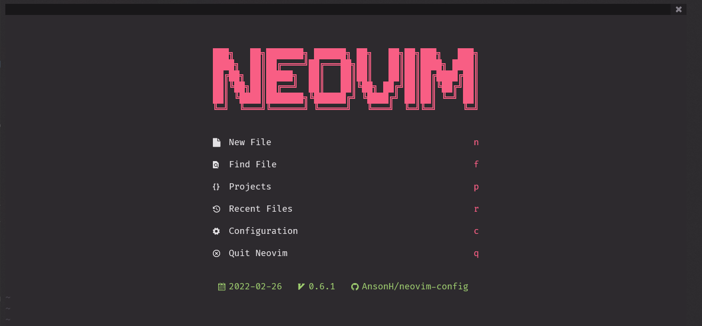
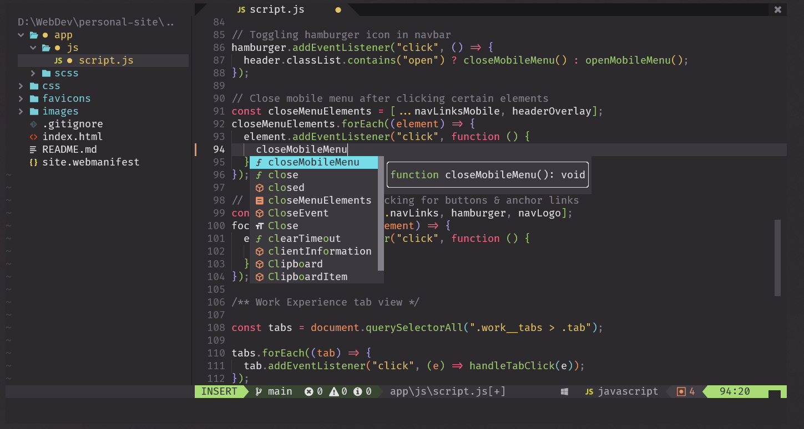

# Neovim Config

My [Neovim](https://neovim.io/) configuration written in Lua.

## Screenshots

(Taken in Windows Terminal with the font of [Fira Code Nerd Font](https://github.com/ryanoasis/nerd-fonts/releases/download/v2.1.0/FiraCode.zip))

## Installation

> ⚠️ Requires Neovim v0.6.0 or greater

[This Notion site](https://ansonheung.notion.site/Installation-Set-Up-874a2a362e4c4d688b345d9f0070e5d2) documents the instructions to set-up this configuration.

## Credits

The code is heavily adapted from [LunarVim/Neovim-from-scratch](https://github.com/LunarVim/Neovim-from-scratch). I mostly followed this this tutorial playlist when creating this configuration: [Neovim from Scratch](https://www.youtube.com/playlist?list=plhoh5vyxr6qq41nfl4gvhfp-wld5xzizz)